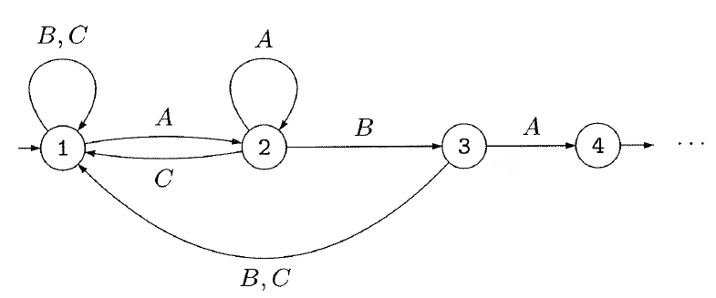

# 状態の意味  
ソフトウェアの状態とは何か，単一のプログラムであれば全てのそこで定義されている変数を組合せることによって作られる1つ1つの組合せだろう．複数のプログラムが別々のスレッドまたはプロセスとして動いていればこれらの状態(ready, wait, run)等も考慮する必要がある．  
これらの状態の1つ1つは，論理命題の真偽の組合せとして表現することができる．また全てを数え切ることもできる．即ち有限である．  
ソフトウェアの仕様のレベルではその仕様が実数や整数を含んでいれば無限状態になるが，これらは実装の過程においてfloat , intなどの有限桁に落とされるので最終的には有限状態になる．モデル検査技術はこれらの状態を与えられたモデルに対して数え上げる．モデル検査技術を使ったプログラム検証ツール[1]はプログラムコードから状態を数え上げる．  
UMLやSysMLの状態図の状態は人間が定義した恣意的なものである．論理命題の真偽とは関係なく思い付きで状態が定義され，後に矛盾が生じて修正される．恣意的に作ったとしても状態を対応する論理命題にマップしていくことで，足りない状態を補完することができる．また，個別の命題の真偽の組合せでは無く，ある論理式が真か偽かで状態を定義することもできる．階層化された状態図を描くこともあるが，上位の状態(合成状態)は論理式によって定義されるべきである．恣意的に作られた階層化状態図には必ず矛盾がありソフトウェアに落とせるようなものでは無い．

## イベントとアクション
ソフトウェアの状態を構成しているもの(変数等)に許される基本操作(アクション)やこれらの変化を伴うイベントごとに1つの状態遷移が対応する．と考えることでソフトウェアをオートマトンとしてモデル化できる．  
簡単なサンプルを考える[2]．3っのキーA, B, Cがあって，このキーをABAの順に押せばドアが開くとする．このソフトは以下の様にモデル化できる．このモデルで，ドアが開いていると言う状態は状態4で成立する．それは，初期状態1からABAのイベントシーケンスで到達するからである．状態と命題とのマッピングで言えば，状態4は「ドアが開いている」と言う命題が真であることに対応している．その他の状態はこの命題の偽に対応している．では，状態1, 2, 3を識別するのはどの様な命題だろうか．

- P_{A}  
- P_{B}  
- P_{C}  

<!--
{ width=60px }  
  
-->  
  
## 動作モデルについて

## まとめ

## 関連情報  
1.[CBMC](https://www.cprover.org/cbmc/)  
2.[Systems and Software Verification: Model-Checking Techniques and Tools](https://amzn.to/3FmU9xG)  
<!-- a href="https://www.amazon.co.jp/Systems-Software-Verification-Model-Checking-Techniques/dp/3540415238?__mk_ja_JP=%E3%82%AB%E3%82%BF%E3%82%AB%E3%83%8A&dchild=1&keywords=Systems+and+Software+Verification&qid=1633521647&sr=8-1&linkCode=li2&tag=tfujikura-22&linkId=e47325a66c1384fb5dc0e29db6b8a9ab&language=ja_JP&ref_=as_li_ss_il" target="_blank"></a>
