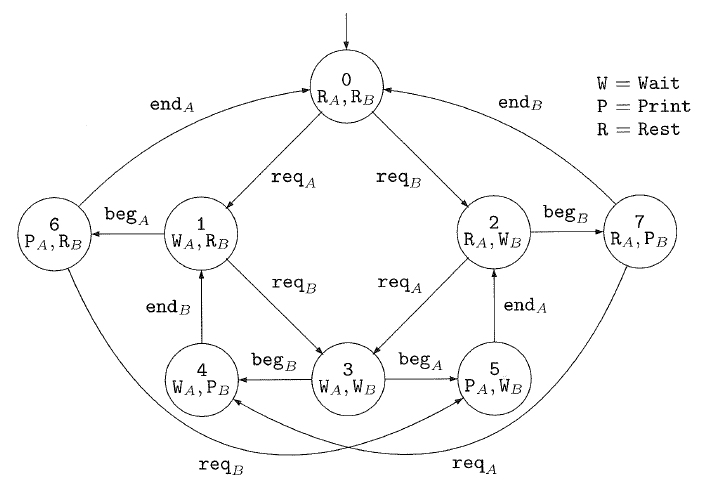
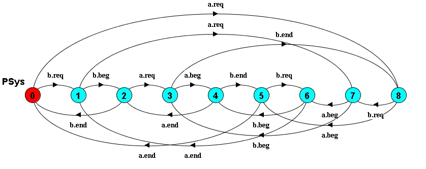
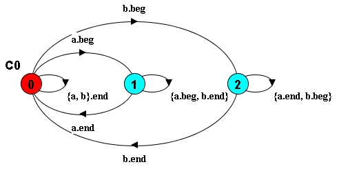

# 検査用モデルの作り方  
[1]に紹介されているプリンタマネージャの動作モデルを以下に示す．このモデルは，二人のユーザA, Bが一つのプリンタを共有している際のプリンタの動作モデルである．プリンタの基本的な動作としては，req, beg, endがある．reqはプリント要求受付，begはプリント開始，endはプリント終了．ユーザ毎にアクションを識別していて，たとえば req<sub>A</sub> は，ユーザAのプリント要求受付である．P, W, Rは命題で，どちらかと言うとユーザーの状態を表す．Pはプリントが終了するのを待っている，Wはプリントが始まるのを待っている，Rは特に要がない状態を表す．[状態の意味](https://embresearch.com/?post=20211006_state_logic)で説明したように，状態の意味は命題で表す．Rはreqする前の状態，Wはbegの前，Pはbegの後でendの前に対応している．Fig.1.6では状態を表す円の中に，そこで成立する命題が書き込んである．

  
[1]のFig 1.6より  


［1］では，このモデルをどの様に作ったのかについて説明は無い．このモデルが与えられていて，要求が無いのにプリントすることは無いと言ったプロパティを証明できることが説明してある．この例だとつまらないけれど，ユーザAの要求ばかり処理してフェアで無いというプロパティも検出できるので意味はある．一般的なモデル検査の立ち位置になっている．  
しかし実際には，このモデルをどの様に作ったのかが重要であり，それが分からないと話が始まらない．それを説明するのがここでの目的である．

## ベースモデル
LTSA[2][3]というモデル検査ツールを用いて[ベースモデル](printer.lts)を作る．プリンタの基本動作は，req, beg, endの繰り返しなので，

```
Printer = (req-> beg -> end -> Printer).
```

となる．AとBで利用するので，

```
||PSys = ({a,b}:Printer).
```

とするとA,Bが利用しているシステムの振る舞いが生成出来る．


  
PSysのLTSA出力  

この状態図をFig.1.6と比べると1つ状態が多い．

## 状態分析

[状態の意味](https://embresearch.com/?post=20211006_state_logic)で説明した手法でベースモデルで生成されている状態を分析する．LTSAには状態図をテキストで出力する機能があるのでそれを利用すると以下の様に，状態とその間の遷移が得られる．ここの各状態に，各命題の真偽をマップすることで動作モデルの厳密な解釈をすることが出来る．すなわち，状態分析がやりやすくなる．

```
PSys = Q0,
	Q0	= (b.req -> Q1    // 要求待ち
		  |a.req -> Q8),
	Q1	= (b.beg -> Q2    // bからの要求受付
		  |a.req -> Q7),
	Q2	= (b.end -> Q0    // bのprint中
		  |a.req -> Q3),
	Q3	= (a.beg -> Q4    // この遷移ダメ, bのprint中だから
		  |b.end -> Q8),
	Q4	= (a.end -> Q2    // 多重プリント，この状態は存在しない．
		  |b.end -> Q5),
	Q5	= (a.end -> Q0
		  |b.req -> Q6),
	Q6	= (a.end -> Q1
		  |b.beg -> Q4),    // この遷移ダメ, aのプリント中だから
	Q7	= (b.beg -> Q3    // aのprint中, bからの要求受付
		  |a.beg -> Q6),
	Q8	= (a.beg -> Q5    // aからの要求受付
		  |b.req -> Q7).
```

各状態を調べるとQ4が同時に印刷をしている状態ことが分かる．実際に，Q4とQ4への遷移を削除して状態図を生成すればFig.1.6と同一の状態図が得られる．修正したモデルを[4]からダウンロードするとPSys3がFig.1.6と同一のモデルになっている．

## 自動生成  
状態分析することで単純な合成では何故ダメなのか，Fig.1.6はどの様に作ったのかが分かったが，状態分析は結構面倒なので自動生成することを検討する．プリンタの排他制御が必要なので，制約条件として追加してやれば良い．具体的には以下の様にして制約条件を定義してそれを表す状態図を生成してベースモデルと合成すれば良い．

```
fluent Pa = <a.beg, a.end> initially 0
fluent Pb = <b.beg, b.end> initially 0

assert C0 = []!(Pa && Pb)
constraint C0 = C0

||PsysM2 = (PSys||C0).
```

生成される制約状態マシンは以下の様になる．

  
制約状態マシン  

assert文は，「命題PAとPBが同時に真になることは無い」という意味である．これは，時相論理式と呼ばれる論理的で，排他制御の典型的なパターンである．PAやPBはその上のfluent文で定義している．たとえば，Paは，アクションa.begを実行すると真になり，a.endを実行すると偽になるという意味である．

## まとめ  
モデル検査用のモデルを生成する方法を説明した．状態分析は必要だけれども状態数が多くなると辛いので，簡単なケースで実施して制約条件として記述した方が良い．制約条件からの自動生成であればユーザー数が増えた場合でも容易に拡張することができる．  
要求&rarr;論理式&rarr;状態マシンという流れは，その状態マシンが何からできているのか正確に説明してくれる．今回のケースで言えば

```
Fig1.6 = PSys + C0
PSys = a:Printer + b:Printer
```

である．

## 関連情報  
1.[Systems and Software Verification: Model-Checking Techniques and Tools](https://amzn.to/3FmU9xG)  
2.[LTSA](https://www.doc.ic.ac.uk/ltsa/)  
3.[Concurrency: State Models and Java Programs](https://amzn.to/3mxg3Wj)  
4.[使用したLTSAモデル](printer.lts)
