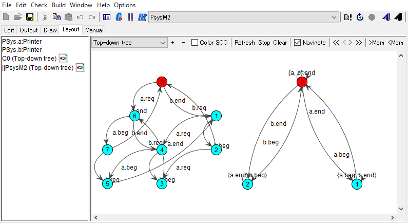

# LTSA-Delforgeのグラフィク機能  
LTSAで作成した状態図を出力する場合pctフォーマットだけだったが，Cedric Delforgeと言う人が修士論文の成果としてSVGフォーマットでも出力できるようにしてくれた．と言っても最近の話では無く2013から使えたらしいが今まで気付かなかった．何が嬉しいかというと

- グラフィクの編集ができる．ドラグして状態の位置を変えることができる．  
- ナビゲーション機能を使って到達可能な状態を可視化できる．これは，前進後退が可能．  
- SVG出力ができる．

  

## 関連情報  
1.[LTSA-Delforge](https://lvl.info.ucl.ac.be/Tools/LTSADelforge)  
